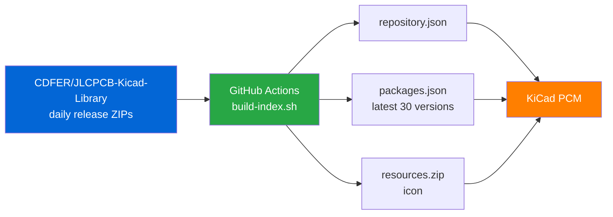

# JLCPCB KiCad Library — EnergyCitizen Mirror 🔌

[](https://opensource.org/licenses/MIT)
[](https://www.kicad.org/)
[](.github/workflows/update.yml)
[](https://buymeacoffee.com/podarok)

> 🔌 An **always-fresh** KiCad Plugin & Content Manager repository for the JLCPCB basic & preferred parts library — symbols, footprints and 3D STEP models, one URL away.

---

## 📋 Table of Contents

- [Why this exists](#-why-this-exists)
- [Install in KiCad](#-install-in-kicad)
- [What you get](#-what-you-get)
- [How it works](#-how-it-works)
- [Updating](#-updating)
- [Credits](#-credits)
- [Support](#-support)
- [License](#-license)

---

## 🤔 Why this exists

The upstream library [CDFER/JLCPCB-Kicad-Library](https://github.com/CDFER/JLCPCB-Kicad-Library) publishes a **fresh release every day** (symbols + footprints + 3D models). But its official PCM index ([cd_fer-kicad-repository](https://github.com/CDFER/cd_fer-kicad-repository)) is **manually maintained and stale** — last updated mid-2025 — so KiCad's Plugin & Content Manager only ever offered an outdated build.

This repository regenerates the PCM index **automatically every day** from the latest upstream releases, so adding one URL to KiCad gets you the current footprints and 3D shapes.

> [!NOTE]
> This is a **packaging mirror**, not a fork of the library content. The actual symbols/footprints/3D models are authored by Chris Dirks (see [Credits](#-credits)). We only rebuild the KiCad PCM repository index pointing at his fresh release ZIPs.

---

## 🚀 Install in KiCad

> [!TIP]
> KiCad **8.0 or newer**. Works on all platforms.

1. **KiCad → Preferences → Manage… → Plugin and Content Manager Repositories**
   (or *Tools → Plugin and Content Manager → Manage…*)
2. Add a new repository with this URL:

   ```
   https://raw.githubusercontent.com/EnergyCitizen/kicad-jlcpcb-library/main/repository.json
   ```

3. In the Plugin & Content Manager, select the repository, open the **Libraries** tab.
4. Install **“JLCPCB KiCad Library”** → **Apply**.
5. Symbols, footprints and 3D models are now available in your editors.

<details>
<summary><strong>Picking an older version</strong></summary>

The index exposes the **latest 30 daily builds**. To install a specific date, pick it from the version dropdown in the Plugin & Content Manager before clicking Install.

</details>

---

## 📦 What you get

| Asset | Contents |
|-------|----------|
| **Symbols** | Schematic symbols for JLCPCB basic & preferred parts |
| **Footprints** | Matched PCB footprints (`.kicad_mod`) |
| **3D models** | `.step` shapes for ~99% of components |
| **Scope** | JLCPCB basic & preferred parts list (no extended-cost setup) |

---

## ⚙️ How it works



Each upstream release ZIP is already a valid KiCad PCM package (root `metadata.json` + `symbols/` `footprints/` `3dmodels/` `resources/`). The daily CI job:

1. Lists the latest 30 releases of the upstream repo.
2. Computes each build's `download_sha256`, `download_size`, `install_size`.
3. Emits `packages.json` (30 versions), `resources.zip` (icon) and `repository.json`.
4. Commits any changes back to `main`.

`download_url` points at the upstream release assets, so no library content is re-hosted here.

> [!IMPORTANT]
> The whole JLCPCB/LCSC component data ecosystem is reverse-engineered (there is no official API). If upstream automation ever breaks, this mirror simply stops advancing — your already-installed library keeps working.

---

## 🔄 Updating

CI runs **daily at 07:30 UTC** (after the upstream ~06:00–07:45 UTC release) and can be triggered manually from the **Actions** tab. KiCad will offer the new version next time you open the Plugin & Content Manager.

To rebuild locally:

```bash
./scripts/build-index.sh
```

> [!NOTE]
> Requires `gh`, `jq`, `curl`, `unzip`, `sha256sum`, `zip`.

---

## 🙏 Credits

- **Library author:** [Chris Dirks (CDFER)](https://github.com/CDFER) — [JLCPCB-Kicad-Library](https://github.com/CDFER/JLCPCB-Kicad-Library) · [keastudios.co.nz](https://keastudios.co.nz/) · MIT licensed.
- **Component data root:** [yaqwsx/jlcparts](https://github.com/yaqwsx/jlcparts).

If you find the library useful, please ⭐ and support the **upstream author** as well.

---

## ☕ Support

If this saves you time, you can support continued maintenance:

[](https://buymeacoffee.com/podarok)

---

## 📄 License

Packaging scripts in this repository: **MIT** (see [LICENSE](LICENSE)).
The mirrored library content is © its respective authors under their own (MIT) license.
